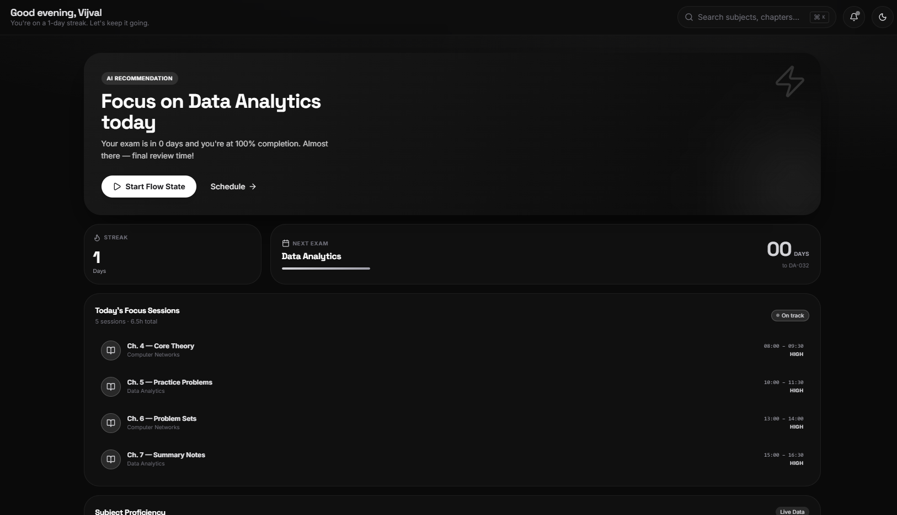
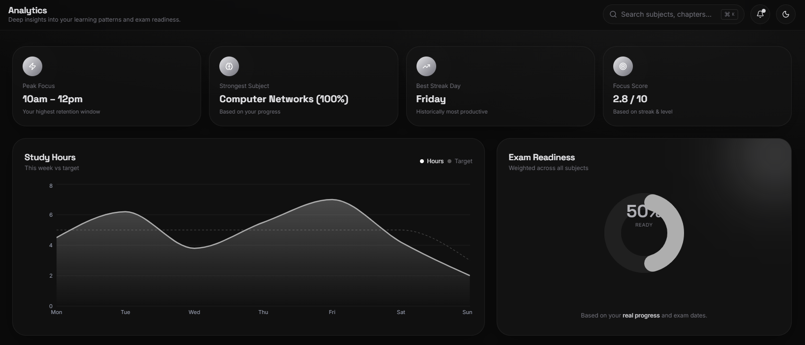
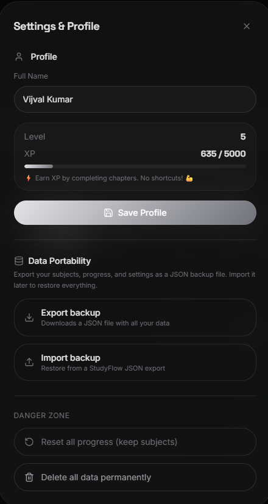

# StudyFlow Planner

An AI-powered study planner built with React and TypeScript. Helps students manage subjects, generate personalized study schedules, track chapter progress, and visualize learning analytics — all stored locally in the browser with no backend required.

Built as a portfolio project to demonstrate full-stack frontend development skills including component architecture, state management, algorithm design, and UI/UX polish.

**🔗 Live Demo:** [study-ai-pro-eta.vercel.app](https://study-ai-pro-eta.vercel.app/)

---

## Screenshots

### Dashboard


### Analytics


### Settings & Data Portability


---

## Features

### Subject Management
- Add, edit, and delete subjects with exam dates, difficulty levels, and chapter lists
- Subjects persist across sessions via localStorage
- Undo delete with a 5-second toast notification window

### AI Study Scheduling
- Automatically generates a daily study plan from your subjects
- Prioritization algorithm based on exam urgency and difficulty weighting
- Weekly planner grid with smart slot allocation
- Time allocation breakdown per subject

### Progress Tracking
- Chapter-by-chapter completion checklist
- Subject progress percentage updates in real time
- Study streak counter with daily tracking
- 4-week consistency heatmap

### XP & Levelling System
- +50 XP per chapter completed
- +500 XP bonus when a subject is fully completed
- Automatic level-up every 1,000 XP
- XP and level visible in the sidebar at all times

### Analytics Dashboard
- Study hours chart (actual vs. target)
- Exam readiness score calculated from real progress and exam dates
- Subject performance bar chart
- Cumulative completion rate trend over 6 weeks
- AI-derived insights (peak focus window, strongest subject, focus score)

### Theme System
- Full light and dark mode with real CSS variable palettes
- Choice persists across sessions
- No flash of wrong theme on page load (inline script in `<head>`)

### Functional TopBar
- Subject search with `Ctrl+K` shortcut
- Notification bell with exam-based alerts
- Theme toggle button

### Data Portability
- Export all data as a JSON backup file
- Import from a JSON backup to fully restore your data
- Reset progress or delete all data from the Settings modal
- Profile name defaults to "Student" for new visitors — editable anytime from Settings

---

## Tech Stack

| Category | Technology |
|---|---|
| Framework | React 18 |
| Language | TypeScript |
| Build Tool | Vite |
| Routing | TanStack Router (file-based) |
| Styling | Tailwind CSS v4 |
| Components | shadcn/ui + Radix UI |
| Charts | Recharts |
| Notifications | Sonner |
| Runtime | Node.js |
| Version Control | Git + GitHub |

---

## Project Structure

```
study-ai-pro/
├── src/
│   ├── components/                  # Reusable UI components
│   │   ├── ui/                      # shadcn/ui base components
│   │   ├── AppSidebar.tsx           # Sidebar — nav, streak, XP bar, profile
│   │   ├── TopBar.tsx               # Search (Ctrl+K), notifications, theme toggle
│   │   ├── SubjectCard.tsx          # Subject card with hover edit/delete + undo toast
│   │   ├── SubjectForm.tsx          # Shared add/edit form with live preview
│   │   ├── ChapterChecklist.tsx     # Chapter completion checklist with XP toasts
│   │   ├── SettingsModal.tsx        # Profile, data portability, danger zone
│   │   ├── Skeleton.tsx             # Loading skeleton components
│   │   └── Toast.tsx                # Centralised toast notification helpers
│   │
│   ├── lib/                         # Data layer and business logic
│   │   ├── subjects-store.ts        # Subject CRUD with localStorage persistence
│   │   ├── progress-store.ts        # Chapter progress, XP system, streak, profile
│   │   ├── scheduler.ts             # Study scheduling prioritisation algorithm
│   │   ├── schedule-store.ts        # Persisted daily + weekly schedule
│   │   ├── analytics.ts             # Derived analytics computed from real data
│   │   ├── store-events.ts          # Global real-time event bus (useStudyAI hook)
│   │   ├── theme-store.ts           # Light/dark theme persistence
│   │   ├── data-portability.ts      # JSON backup export and import
│   │   └── mock-data.ts             # TypeScript types + seed data
│   │
│   ├── routes/                      # TanStack Router file-based pages
│   │   ├── __root.tsx               # Root layout, theme init script, Toaster
│   │   ├── index.tsx                # Dashboard — live stats, AI recommendation
│   │   ├── subjects.index.tsx       # Subjects list with loading skeletons
│   │   ├── subjects.add.tsx         # Add subject page
│   │   ├── subjects.$id.edit.tsx    # Edit subject page
│   │   ├── schedule.tsx             # Daily plan + weekly planner grid
│   │   ├── progress.tsx             # Chapter checklists + consistency heatmap
│   │   └── analytics.tsx            # Charts — hours, readiness, performance
│   │
│   ├── styles.css                   # Tailwind v4 config + light/dark CSS variables
│   └── routeTree.gen.ts             # Auto-generated TanStack Router route tree
│
├── public/
├── screenshots/                     # README screenshots
├── package.json
├── tsconfig.json
├── vite.config.ts
└── README.md
```

---

## Getting Started

```bash
# Clone the repo
git clone https://github.com/Vijvalkumarsingh/study-ai-pro.git
cd study-ai-pro

# Install dependencies
npm install

# Start the dev server
npm run dev
```

Open `http://localhost:8080` in your browser.

---

## How It Works

### Scheduling Algorithm

Subjects are scored using a weighted formula:

```
score = (difficulty × 10) + urgency bonus + incompleteness bonus
```

- **Difficulty weight**: Hard = 3, Medium = 2, Easy = 1
- **Urgency bonus**: ≤7 days = +30, ≤14 days = +20, ≤21 days = +10
- **Incompleteness bonus**: (1 − progress%) × 10

Subjects are ranked by score and assigned to fixed study blocks throughout the day in priority order using round-robin allocation.

### Real-Time Sync

A lightweight global event bus (`store-events.ts`) fires a custom DOM event (`studyai:update`) whenever any store writes to localStorage. The `useStudyAI` hook subscribes to this event and re-runs the selector, keeping the sidebar XP bar, streak counter, and dashboard live without page refreshes.

### Theme System

The saved theme preference is read from localStorage and applied to `<html>` via an inline script in `<head>` before React mounts, eliminating any flash of the wrong theme on load.

---

## Development Phases

| Phase | Feature | Status |
|---|---|---|
| 1 | Subject management (CRUD + localStorage) | ✅ Done |
| 2 | Study scheduling algorithm | ✅ Done |
| 3 | Progress tracking + XP system | ✅ Done |
| 4 | Analytics dashboard (live charts) | ✅ Done |
| 5 | Light/dark theme system | ✅ Done |
| 6 | Toast notifications, undo delete, loading skeletons | ✅ Done |
| 9 | Data export/import (JSON backup) | ✅ Done |

---

## Author

**Vijval Kumar Singh**
B.Tech Computer Science (AI & ML) — Galgotias College of Engineering & Technology

[GitHub](https://github.com/Vijvalkumarsingh)

---

## License

MIT